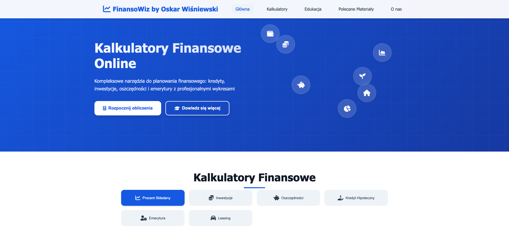

# FinansoWiz Kalkulator Finansowy

Witaj w FinansoWiz! Jest to intuicyjny kalkulator finansowy online, stworzony, aby pomóc Ci w podejmowaniu świadomych decyzji dotyczących Twoich finansów osobistych i inwestycji. Aplikacja oferuje zestaw narzędzi do analizy procentu składanego, planowania kredytów, oszczędności, emerytury oraz leasingu.

 
<!-- Pamiętaj, aby dodać zrzut ekranu do folderu img i nazwać go screenshot.png lub zaktualizować ścieżkę -->

## Spis Treści

- [Funkcjonalności](#funkcjonalności)
- [Dostępne Kalkulatory](#dostępne-kalkulatory)
- [Akademia Finansowa](#akademia-finansowa)
- [Polecane Materiały](#polecane-materiały)
- [Technologie](#technologie)
- [Uruchomienie](#uruchomienie)
- [Jak wnieść wkład?](#jak-wnieść-wkład)
- [Autor](#autor)
- [Licencja](#licencja)

## Funkcjonalności

*   **Interaktywne Kalkulatory**: Obliczaj przyszłą wartość inwestycji, raty kredytowe, czas potrzebny na osiągnięcie celu oszczędnościowego i wiele więcej.
*   **Wizualizacja Danych**: Wyniki prezentowane są nie tylko liczbowo, ale również w formie dynamicznych wykresów (liniowych i słupkowych skumulowanych), ułatwiających zrozumienie dynamiki finansowej.
*   **Szczegółowe Zestawienia**: Dla procentu składanego dostępne jest roczne zestawienie pokazujące przyrost kapitału, wpłat i odsetek.
*   **Edukacja Finansowa**: Sekcja "Akademia Finansowa" dostarcza podstawowej i zaawansowanej wiedzy na temat zarządzania budżetem, oszczędzania, inwestowania i strategii finansowych.
*   **Polecane Źródła**: Zbiór linków do wartościowych blogów, kanałów YouTube i stron instytucji finansowych, aby dalej poszerzać swoją wiedzę.
*   **Responsywny Design**: Strona jest w pełni responsywna i dostosowuje się do różnych rozmiarów ekranów (komputery, tablety, telefony).
*   **Nowoczesny Interfejs**: Czysty i przyjazny dla użytkownika interfejs ułatwiający nawigację i korzystanie z narzędzi.

## Dostępne Kalkulatory

1.  **Procent Składany**: Oblicz, jak Twoje pieniądze mogą rosnąć w czasie dzięki magii procentu składanego, uwzględniając wpłatę początkową, regularne dopłaty, oprocentowanie i różne częstotliwości kapitalizacji.
2.  **Inwestycje**: Prognozuj wartość swoich inwestycji, biorąc pod uwagę oczekiwany zwrot i wpływ inflacji.
3.  **Oszczędności**: Określ, ile czasu potrzebujesz, aby osiągnąć swój cel oszczędnościowy.
4.  **Kredyt Hipoteczny**: Oblicz miesięczną ratę, całkowity koszt kredytu i sumę odsetek dla rat równych lub malejących.
5.  **Emerytura**: Oszacuj, jaki kapitał możesz zgromadzić na emeryturę i jaki może być Twój miesięczny dochód.
6.  **Leasing**: Kalkulator raty leasingowej dla samochodów lub innych przedmiotów.

## Akademia Finansowa

Sekcja edukacyjna podzielona na materiały dla początkujących i bardziej zaawansowanych użytkowników, obejmująca tematy takie jak:
*   Zarządzanie budżetem domowym
*   Budowanie poduszki finansowej
*   Mądre zarządzanie długiem
*   Różnice między oszczędzaniem a inwestowaniem
*   Dywersyfikacja portfela
*   Podstawy analizy fundamentalnej
*   Psychologia inwestowania
*   Popularne strategie inwestycyjne

## Polecane Materiały

Starannie wyselekcjonowana lista zasobów do dalszej nauki o finansach i inwestowaniu:
*   Polskie kanały YouTube (np. Marcin Iwuć, Zawód Inwestor, Piotr Cymcyk, Tomasz Trela)
*   Blogi i strony finansowe (np. Jak Oszczędzać Pieniądze, Subiektywnie o Finansach)
*   Instytucje i portale edukacyjne (np. GPW, NBP, KNF)

## Technologie

Projekt został zbudowany przy użyciu następujących technologii:

*   **HTML5**
*   **CSS3** (w tym Flexbox, Grid dla responsywnego layoutu)
*   **JavaScript (ES6+)** (dla logiki kalkulatorów i interaktywności)
*   **Chart.js** (do generowania dynamicznych wykresów)
*   **Font Awesome** (dla ikon)

## Uruchomienie

Strona jest hostowana na GitHub Pages i dostępna publicznie pod adresem:
[https://oskareczq.github.io/FinansoWiz-kalkulator/](https://oskareczq.github.io/FinansoWiz-kalkulator/)

Aby uruchomić projekt lokalnie:
1.  Sklonuj repozytorium:
    ```
    git clone https://github.com/oskareczq/FinansoWiz-kalkulator.git
    ```
2.  Przejdź do katalogu projektu:
    ```
    cd FinansoWiz-kalkulator
    ```
3.  Otwórz plik `index.html` w przeglądarce internetowej.

Nie są wymagane żadne dodatkowe kroki budowania ani instalacji zależności dla podstawowej funkcjonalności.

## Jak wnieść wkład?

Jeśli masz pomysły na nowe funkcjonalności, ulepszenia lub znalazłeś błąd, zachęcam do działania:
1.  Zrób fork repozytorium.
2.  Stwórz nową gałąź (`git checkout -b twoja-funkcja`).
3.  Wprowadź swoje zmiany.
4.  Zrób commit swoich zmian (`git commit -m 'Dodaj nową funkcję X'`).
5.  Wypchnij zmiany do swojej gałęzi (`git push origin twoja-funkcja`).
6.  Otwórz Pull Request.

## Autor

**Oskar Wiśniewski**
*   GitHub: [@oskareczq](https://github.com/oskareczq)
*   Email: [oskarwisniewski3@gmail.com](mailto:oskarwisniewski3@gmail.com)

## Licencja

Ten projekt jest udostępniany na licencji MIT. Zobacz plik `LICENSE` (jeśli go dodasz) po więcej szczegółów.
(Jeśli nie masz pliku LICENSE, możesz pominąć tę sekcję lub dodać go. Dla projektów open-source licencja MIT jest popularnym wyborem.)
